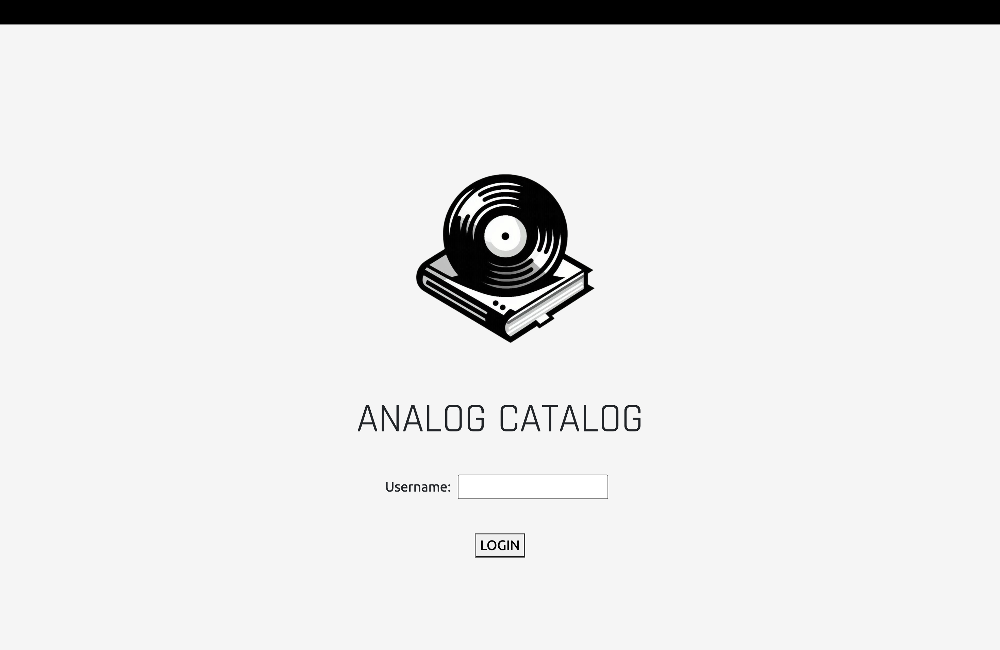
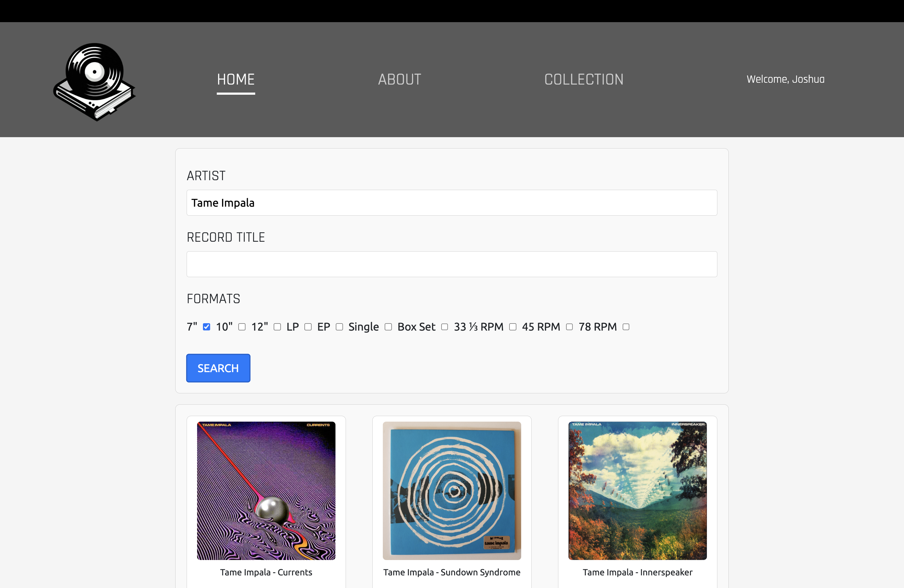
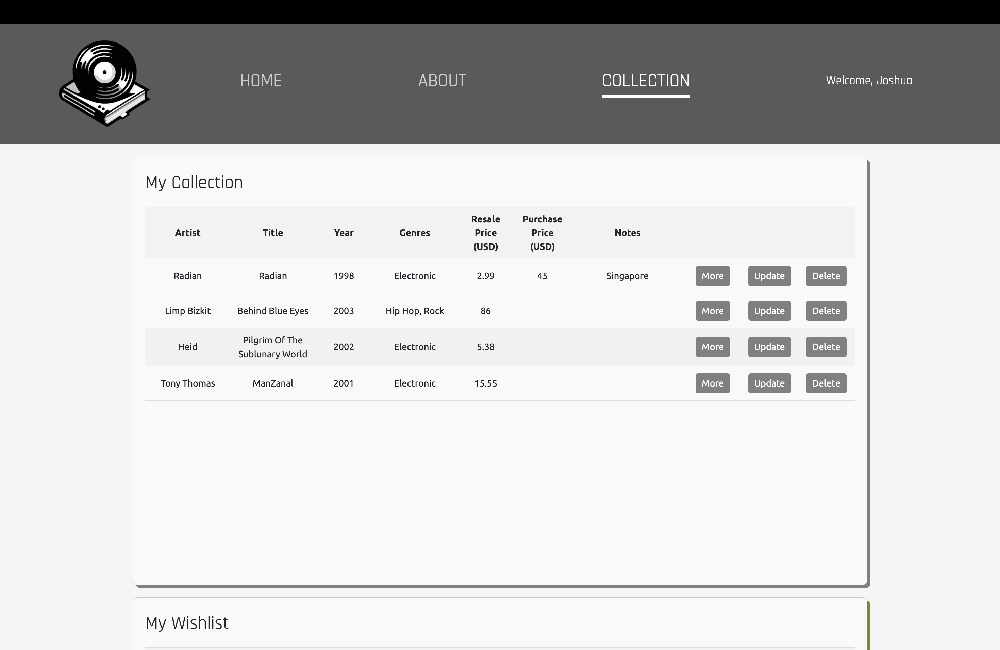
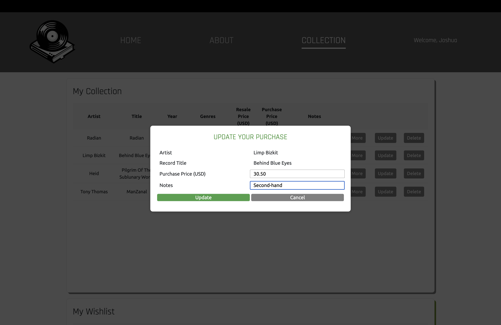

# ANALOG CATALOG


**ANALOG CATALOG** (although I would have preferred "Analogue Catalogue" because British English) is targeted at record enthusiasts looking to catalogue and value their vinyl collections. The application was designed in React.js and completed as a professional course project. It uses the open-source Discogs© webAPI, fetching data from Discogs' database and marketplace to present consolidated information about your records.

## Background

Discogs is the largest community-driven online database and marketplace for all things vinyl. Users can discover new artists and albums, or purchase rare vinyls from their favourite artists. Think of Discogs as Carousell (for you Singaporeans) except it's more international (like eBay) and just for physical music.

As a vinyl collector myself, I have relied on maintaining an Excel sheet to keep track of the music I own. That has, however, been laborious as I have had to key individual details of each record.

I  learnt that Discogs provided a free-to-use WebAPI (Application Programming Interface) for developers to access their music database and design applications. So, I embarked on the Analog Catalog project using my recently acquired skills in React.js and API calls to re-design the process of electronically cataloguing one's record collection. 

Analog Catalog hopes to take away all that weary Excel crunching and make this process possible with Discogs API and simple button clicks!

## Technologies

- HTML 5
- CSS 3
- Javascript
- React.js
- Discogs API
- Airtable
- Postman
- Docker

## Getting Started

Access the project's public board [here](https://github.com/users/jxrchan/projects/1).

### Setting Up Guide

1. Clone the Repository

   ```bash
   git clone https://github.com/jxrchan/analogCatalog
   ```

2. Navigate to the root directory

   ```bash
   cd ./analogCatalog
   ```

3. Create a `.env` file within the root

   ```bash
   touch .env
   ```

4. Add the following environmental variables inside the `.env` file

   ```bash
   VITE_DISCOGS_API
   VITE_CONSUMER_KEY
   VITE_CONSUMER_SECRET
   VITE_AIRTABLE_TOKEN
   ```

5. Install Dependencies

   ```bash
   npm i
   ```

   ```bash
   npm i react-router-dom@6
   ```

6. Start the Development Server

   ```bash
   npm run dev
   ```

7. Access the Application

Open your browser and visit [http://localhost:5173](http://localhost:5173).

## Application Interface



The application begins with a login page which currently has no implemented authentication logic.

_Username is stored in a state which is then passed into the Airtable. It is used as a unique identifier to display the user's custom records._



Search for records in the Home page using any combination of artist name, record title, and format. Hover over your record of interest and click on add to collection or wishlist. Navigate to previous and next search results using the link at the bottom of the page.

_This page uses the search endpoint of Discogs' API. I have currently limited the fetch query to display 15 results per page._




The collection pages display two lists: "My Collection" and "My Wishlist," which populate based on your actions on the Home page. Further information, including genres and current marketplace price (unfortunately only USD at this point) for your selected records, is automatically stored in this table.

The 'More' button navigates to Discogs' webpage for the record. The 'Update' button allows users to input more information about their collected record. The 'Delete' button removes a record from the database.

*This page uses the 'Release' endpoint of Discogs' API to fetch further details about records of interest that were not in the 'Search' endpoint. Updating and deleting records work through Airtable's API.*

## Credits & Attributions

- This game uses the Rajdhani and Ubuntu sans-serif fonts designed by Jyotish Sonowal and Satya Rajpurohit, and Dalton Maag respectively.
- The background image was generated using Bing's image creator tool that runs on Microsoft Copilot.
- Discogs and all their awesome users.

## Next Steps

Future iterations of the project may include the following:

- Use of a real-time currency conversion API to convert Discogs' marketplace prices to user's currency of choice.
- Sorting functions within My Collection and My Wishlist.
- Proper username and password authentication with back-end validation.
